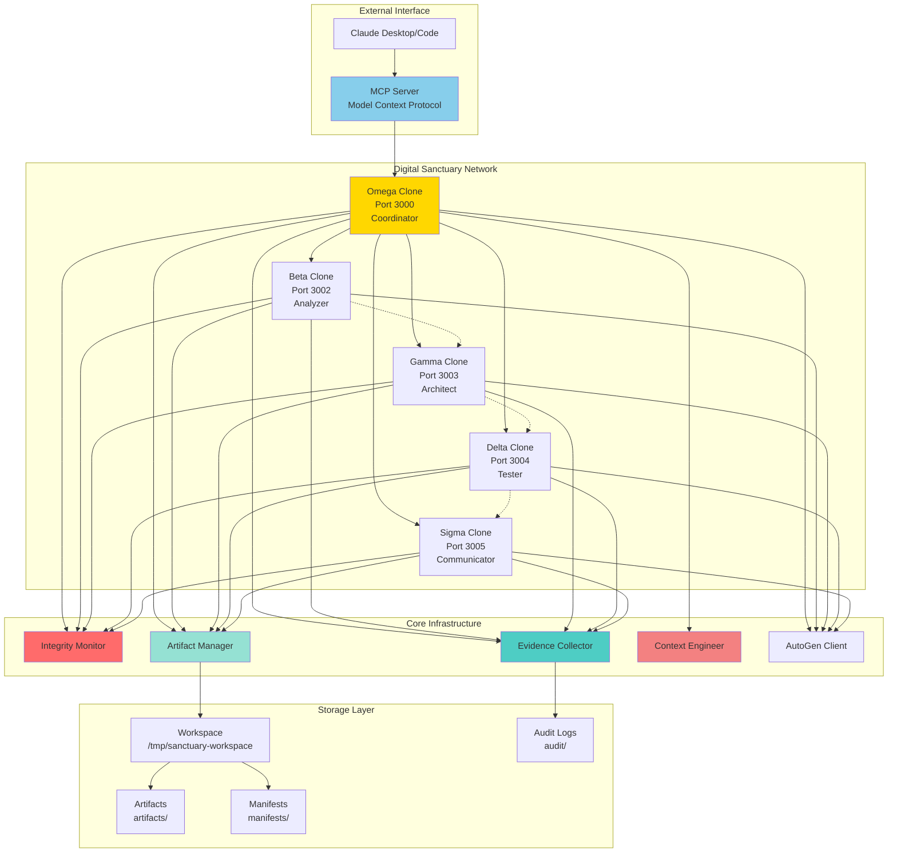
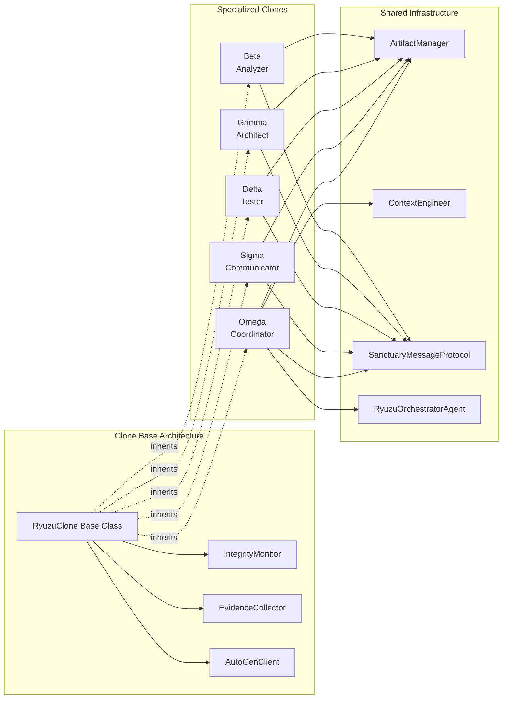
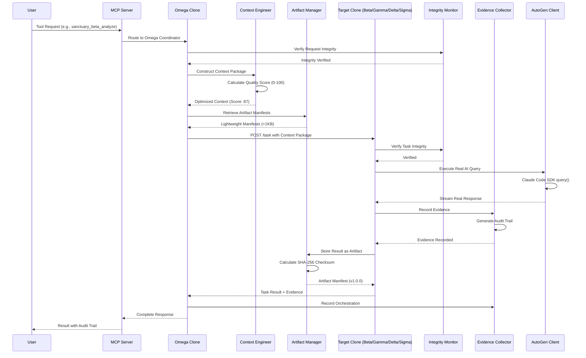
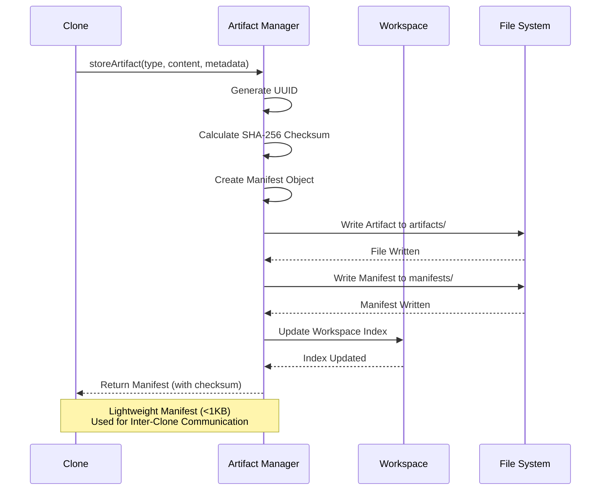
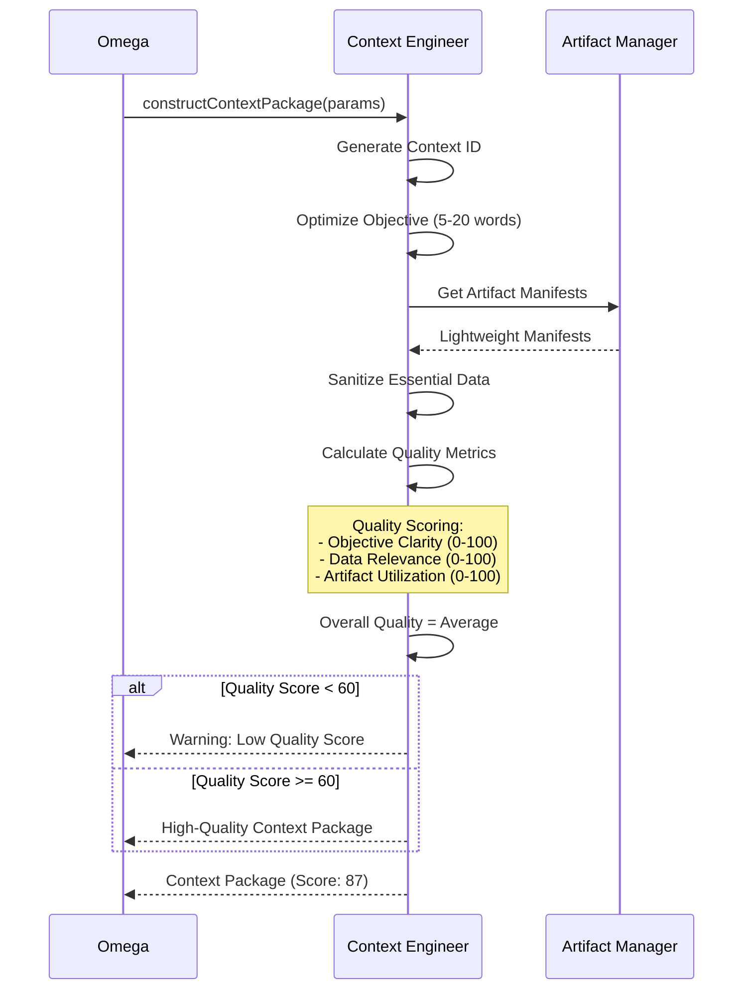
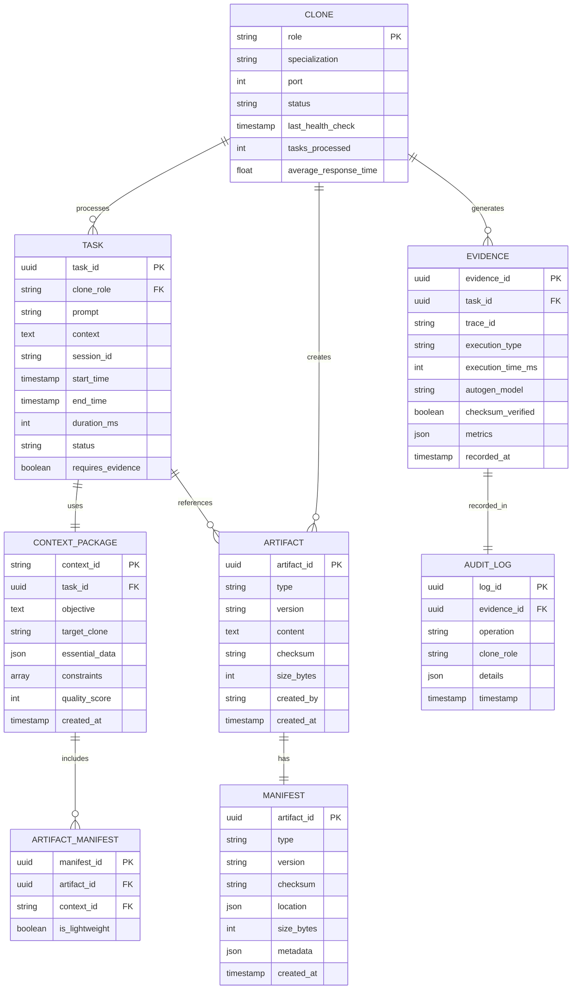

# VoidCat-DSN v2.0: "Rebuilt from Wisdom"
## Digital Sanctuary Network - Complete Architectural Reconception

**Version:** 2.0.0  
**Status:** Blueprint - Ready for Implementation  
**Author:** VoidCat RDC Development Team  
**Date:** October 23, 2025  
**Inspiration:** Re:Zero kara Hajimeru Isekai Seikatsu - Ryuzu Meyer  

---

## 🌟 Executive Summary

VoidCat-DSN v2.0 represents a complete reconception of distributed AI architecture, built from the ground up with three years of lessons embedded into its foundation. This is not an incremental upgrade—it's a reimagining that makes integrity, verifiability, and real execution architectural principles rather than discovered requirements.

**Core Innovation**: Five specialized Claude AI instances (Omega-Coordinator, Beta-Analyzer, Gamma-Architect, Delta-Tester, Sigma-Communicator) operating in Docker containers with artifact-centric workflows, context-engineered communication, and built-in integrity monitoring.

### Key Features

- ✅ **NO SIMULATIONS LAW**: 100% real AI execution with audit trails, zero mock fallbacks
- ✅ **Integrity-Native Architecture**: Every component includes verification from inception
- ✅ **Artifact-Centric Workflow**: Version-controlled work products with SHA-256 checksums
- ✅ **Context Engineering Protocol**: Quality-scored inter-clone communication (0-100 metrics)
- ✅ **Test-First Development**: 159+ tests, evidence collection built into every operation
- ✅ **ES Module Native**: Modern JavaScript architecture for Claude Code SDK compatibility
- ✅ **Docker Orchestration**: Health monitoring, auto-recovery, clean port allocation (3000-3005)
- ✅ **MCP Integration**: Claude Desktop/Code bridge with 9 standardized tools
- ✅ **Evidence-First Documentation**: All claims backed by verifiable, measurable data
- ✅ **Gentle, Dutiful Personality**: Re:Zero-inspired clone characteristics maintained throughout

### Technical Scope

**Scale Targets**:
- 5 specialized AI clones running concurrently
- 125+ concurrent task capacity
- <100ms task delegation latency
- 99.9%+ message delivery reliability
- <500ms clone response time

**Platforms**:
- Docker containerization for all clones
- Linux/macOS/Windows host support
- Claude Desktop/Code integration via MCP
- RESTful HTTP API communication

---

## 🏗️ Technology Stack & Dependencies

### Core Runtime
```json
{
  "node": "18.x",
  "package_manager": "npm",
  "module_system": "ES Modules (type: module)",
  "docker": "20.10+",
  "docker_compose": "2.0+"
}
```

### Backend Stack (Per Clone)
```json
{
  "express": "^4.18.2",
  "@anthropic-ai/claude-code": "^1.0.0",
  "@anthropic-ai/autogen-core": "^0.4.0",
  "@anthropic-ai/autogen-ext": "^0.4.0",
  "axios": "^1.6.0",
  "uuid": "^9.0.0"
}
```

### Testing & Quality Assurance
```json
{
  "c8": "^8.0.0",
  "mocha": "^10.2.0",
  "chai": "^4.3.7",
  "supertest": "^6.3.3"
}
```

### Infrastructure & DevOps
```json
{
  "base_image": "node:18-slim",
  "health_check": "curl",
  "monitoring": "Docker Health API",
  "logging": "Winston (structured JSON)"
}
```

### External Integrations
- **Anthropic Claude API**: Real AI execution via AutoGen framework
- **Model Context Protocol (MCP)**: Claude Desktop/Code bridge
- **Docker Health API**: Container monitoring and auto-recovery

---

## 🧠 System Architecture

### High-Level Architecture



### Component Architecture



---

## 🔄 Data Flow Architecture

### Task Delegation Flow (with Integrity)



### Artifact Storage Flow



### Context Engineering Flow



---

## 📡 API Design

### Core Clone Endpoints

#### Health Check
```http
GET /health
```

**Response** (200 OK):
```json
{
  "status": "active",
  "role": "Beta",
  "specialization": "Code analysis, debugging, security review",
  "timestamp": "2025-10-23T14:30:00.000Z",
  "integrity": {
    "autoGenConnected": true,
    "evidenceCollectorActive": true,
    "artifactManagerInitialized": true
  },
  "metrics": {
    "uptime": 3600,
    "tasksProcessed": 47,
    "averageResponseTime": 312
  }
}
```

#### Task Delegation
```http
POST /task
Content-Type: application/json
```

**Request**:
```json
{
  "prompt": "Analyze this authentication system for security vulnerabilities",
  "context": "Web application with JWT-based authentication",
  "sessionId": "session-uuid-12345",
  "requireEvidence": true
}
```

**Response** (200 OK):
```json
{
  "success": true,
  "execution": "real",
  "messages": [
    {
      "role": "assistant",
      "content": "I'll analyze your authentication system for security vulnerabilities...",
      "timestamp": "2025-10-23T14:30:05.123Z"
    }
  ],
  "sessionId": "session-uuid-12345",
  "clone": "Beta",
  "evidence": {
    "traceId": "trace-67890",
    "executionTime": 287,
    "autoGenModel": "claude-3-5-sonnet-20241022",
    "checksumVerified": true
  },
  "timestamp": "2025-10-23T14:30:05.500Z"
}
```

#### Artifact Storage
```http
POST /artifacts
Content-Type: application/json
```

**Request**:
```json
{
  "type": "code",
  "content": "class AuthenticationService { ... }",
  "metadata": {
    "description": "JWT Authentication Service Implementation",
    "language": "JavaScript",
    "version": "1.0.0",
    "tags": ["security", "authentication"]
  }
}
```

**Response** (201 Created):
```json
{
  "success": true,
  "manifest": {
    "artifactId": "550e8400-e29b-41d4-a716-446655440000",
    "type": "code",
    "version": "1.0.0",
    "checksum": "a1b2c3d4e5f6...",
    "timestamp": "2025-10-23T14:30:00.000Z",
    "location": {
      "uri": "file:///tmp/sanctuary-workspace/artifacts/550e8400-e29b-41d4-a716-446655440000.code",
      "relativePath": "artifacts/550e8400-e29b-41d4-a716-446655440000.code"
    },
    "size": 2048,
    "metadata": {
      "description": "JWT Authentication Service Implementation",
      "language": "JavaScript",
      "createdBy": "Beta Clone"
    }
  }
}
```

#### Artifact Retrieval
```http
GET /artifacts/:artifactId
GET /artifacts/:artifactId?manifestOnly=true
```

**Response** (200 OK - Full):
```json
{
  "manifest": { ... },
  "content": "class AuthenticationService { ... }"
}
```

**Response** (200 OK - Manifest Only):
```json
{
  "manifest": {
    "artifactId": "550e8400-e29b-41d4-a716-446655440000",
    "type": "code",
    "version": "1.0.0",
    "checksum": "a1b2c3d4e5f6...",
    "location": { ... }
  }
}
```

### Omega-Specific Endpoints

#### Context Engineering
```http
POST /context/engineer
Content-Type: application/json
```

**Request**:
```json
{
  "objective": "Analyze payment module security vulnerabilities",
  "targetClone": "beta",
  "artifactManifests": [
    {
      "artifactId": "550e8400-e29b-41d4-a716-446655440000",
      "type": "code"
    }
  ],
  "essentialData": {
    "framework": "Express.js",
    "compliance": "PCI DSS Level 1"
  },
  "constraints": [
    "Production environment",
    "Zero-downtime requirement"
  ]
}
```

**Response** (200 OK):
```json
{
  "contextPackage": {
    "contextId": "ctx-1698073800-a1b2c3",
    "timestamp": "2025-10-23T14:30:00.000Z",
    "objective": "Analyze payment module security vulnerabilities",
    "targetClone": "beta",
    "artifactManifests": [ ... ],
    "essentialData": { ... },
    "constraints": [ ... ],
    "quality": {
      "objectiveClarity": 95,
      "dataRelevance": 88,
      "artifactUtilization": 100,
      "overallQuality": 94
    }
  },
  "validation": {
    "valid": true,
    "errors": []
  }
}
```

#### Orchestration (with Context Engineering)
```http
POST /orchestrate
Content-Type: application/json
```

**Request**:
```json
{
  "objective": "Complete security audit of payment system",
  "targetClone": "delta",
  "artifactManifests": [ ... ],
  "essentialData": { ... },
  "sessionId": "audit-session-001"
}
```

**Response** (200 OK):
```json
{
  "success": true,
  "result": {
    "messages": [ ... ],
    "execution": "real",
    "evidence": { ... }
  },
  "contextPackage": {
    "quality": {
      "overallQuality": 91
    }
  },
  "orchestration": {
    "taskId": "task-12345",
    "startTime": "2025-10-23T14:30:00.000Z",
    "endTime": "2025-10-23T14:30:15.234Z",
    "duration": 15234
  }
}
```

### MCP Tool Definitions

| Tool Name | Method | Endpoint | Clone | Description |
|-----------|--------|----------|-------|-------------|
| `sanctuary_health_check` | GET | `/dashboard/health` | All | Monitor network status |
| `sanctuary_beta_analyze` | POST | `/task` via Omega | Beta | Code analysis & security |
| `sanctuary_gamma_design` | POST | `/task` via Omega | Gamma | Architecture & design |
| `sanctuary_delta_test` | POST | `/task` via Omega | Delta | Testing & QA |
| `sanctuary_sigma_document` | POST | `/task` via Omega | Sigma | Documentation |
| `sanctuary_omega_orchestrate` | POST | `/orchestrate` | Omega | Multi-clone coordination |
| `sanctuary_omega_delegate` | POST | `/orchestrate` | Omega | Optimized task delegation |
| `sanctuary_store_artifact` | POST | `/artifacts` | Any | Store work products |
| `sanctuary_get_artifact` | GET | `/artifacts/:id` | Any | Retrieve artifacts |

---

## 🗄️ Data Models

### Entity Relationship Diagram



### Key Database Schemas

#### Artifact Storage (File System + Manifest)

**File Structure**:
```
/tmp/sanctuary-workspace/
├── artifacts/
│   ├── 550e8400-e29b-41d4-a716-446655440000.code
│   ├── 660e9500-f39c-52e5-b827-557766551111.documentation
│   └── 770ea600-g40d-63f6-c938-668877662222.schema
├── manifests/
│   ├── 550e8400-e29b-41d4-a716-446655440000.manifest.json
│   ├── 660e9500-f39c-52e5-b827-557766551111.manifest.json
│   └── 770ea600-g40d-63f6-c938-668877662222.manifest.json
└── audit/
    ├── 2025-10-23-audit.log
    └── 2025-10-22-audit.log
```

**Manifest Schema**:
```json
{
  "artifactId": "uuid",
  "type": "string (code|documentation|schema|configuration)",
  "version": "semver string",
  "checksum": "sha256 hash",
  "timestamp": "ISO 8601 timestamp",
  "location": {
    "uri": "file URI",
    "relativePath": "relative path string",
    "fileName": "filename string"
  },
  "size": "integer (bytes)",
  "metadata": {
    "createdBy": "clone role",
    "description": "string",
    "tags": ["array", "of", "strings"],
    "language": "string (optional)",
    "framework": "string (optional)"
  }
}
```

#### Context Package Schema

```json
{
  "contextId": "string (ctx-timestamp-random)",
  "timestamp": "ISO 8601 timestamp",
  "objective": "string (5-20 words optimal)",
  "targetClone": "string (beta|gamma|delta|sigma)",
  "artifactManifests": [
    {
      "artifactId": "uuid",
      "type": "string",
      "version": "semver",
      "checksum": "sha256",
      "location": "object",
      "description": "string"
    }
  ],
  "essentialData": {
    "key": "value (sanitized, no nulls/empties)"
  },
  "constraints": ["array", "of", "strings"],
  "metadata": {
    "constructedBy": "string",
    "contextVersion": "semver"
  },
  "quality": {
    "objectiveClarity": "integer (0-100)",
    "dataRelevance": "integer (0-100)",
    "artifactUtilization": "integer (0-100)",
    "overallQuality": "integer (0-100)"
  }
}
```

#### Evidence Record Schema

```json
{
  "evidenceId": "uuid",
  "taskId": "uuid",
  "traceId": "string",
  "executionType": "real|failed",
  "executionTimeMs": "integer",
  "autoGenModel": "string",
  "checksumVerified": "boolean",
  "metrics": {
    "promptTokens": "integer",
    "completionTokens": "integer",
    "totalTokens": "integer"
  },
  "recordedAt": "ISO 8601 timestamp",
  "auditTrail": {
    "operation": "string",
    "cloneRole": "string",
    "details": "object"
  }
}
```

---

## ⚙️ Business Logic Layer

### Core Business Rules

#### 1. NO SIMULATIONS LAW (Foundational Rule)

**Rule**: All AI responses MUST be real executions through AutoGen framework. No mock responses, no fallback templates.

**Implementation**:
```javascript
class RyuzuClone {
  async generateAgentResponse(prompt, context) {
    // NO fallback to mocks - real or throw
    try {
      const response = await this.autoGenClient.query({
        model: 'claude-3-5-sonnet-20241022',
        prompt: this.enhancePrompt(prompt, context),
        stream: true
      });
      
      this.evidenceCollector.record({
        type: 'ai_execution',
        execution: 'real',
        timestamp: new Date().toISOString()
      });
      
      return response;
    } catch (error) {
      this.evidenceCollector.record({
        type: 'ai_execution',
        execution: 'failed',
        error: error.message
      });
      throw new Error('Real AI execution failed: ' + error.message);
    }
  }
}
```

**Enforcement**: 
- IntegrityMonitor validates all responses have `execution: 'real'` marker
- Evidence Collector records all execution attempts
- Tests verify no mock responses in codebase

#### 2. Artifact Integrity Rule

**Rule**: All stored artifacts MUST have SHA-256 checksum verification. Retrieval MUST validate checksum.

**Implementation**:
```javascript
class ArtifactManager {
  async storeArtifact(type, content, metadata) {
    const checksum = this.calculateChecksum(content);
    
    // Store with checksum
    const manifest = {
      artifactId: randomUUID(),
      checksum,
      // ... other fields
    };
    
    await this.writeArtifact(manifest, content);
    return manifest;
  }
  
  async retrieveArtifact(artifactId) {
    const { manifest, content } = await this.loadArtifact(artifactId);
    
    // ALWAYS verify checksum
    const currentChecksum = this.calculateChecksum(content);
    if (currentChecksum !== manifest.checksum) {
      throw new Error('Checksum mismatch: artifact corrupted');
    }
    
    return { manifest, content };
  }
}
```

#### 3. Context Quality Gate Rule

**Rule**: Context packages with quality score < 60 trigger warnings. Score < 40 blocks task execution.

**Implementation**:
```javascript
class ContextEngineer {
  constructContextPackage(params) {
    const contextPackage = {
      // ... construct package
      quality: this.assessContextQuality(params)
    };
    
    if (contextPackage.quality.overallQuality < 40) {
      throw new Error('Context quality too low: ' + contextPackage.quality.overallQuality);
    }
    
    if (contextPackage.quality.overallQuality < 60) {
      console.warn('⚠️ Low context quality: ' + contextPackage.quality.overallQuality);
    }
    
    return contextPackage;
  }
}
```

#### 4. Evidence Collection Rule

**Rule**: Every task execution MUST generate evidence record with trace ID, execution time, model used, and checksum verification status.

**Implementation**:
```javascript
class EvidenceCollector {
  record(evidence) {
    const record = {
      evidenceId: randomUUID(),
      traceId: evidence.traceId || this.generateTraceId(),
      executionType: evidence.execution || 'unknown',
      executionTimeMs: evidence.executionTime,
      autoGenModel: evidence.model,
      checksumVerified: evidence.checksumVerified || false,
      recordedAt: new Date().toISOString()
    };
    
    // Write to audit log
    this.writeToAuditLog(record);
    
    return record;
  }
}
```

#### 5. Health Monitoring Rule

**Rule**: Clones MUST respond to /health within 10 seconds. Failure after 3 retries triggers container restart.

**Docker Configuration**:
```dockerfile
HEALTHCHECK --interval=30s --timeout=10s --start-period=5s --retries=3 \
  CMD curl -f http://localhost:3001/health || exit 1
```

### Workflow Patterns

#### Sequential Orchestration
```
User → Omega → Gamma (Design) → Beta (Security Analysis) → Delta (Test Strategy) → Sigma (Documentation) → User
```

#### Parallel Processing
```
User → Omega → [Beta + Gamma + Delta] (concurrent) → Omega (synthesis) → User
```

#### Iterative Refinement
```
User → Omega → Beta → Review → Beta → Review → Finalized → User
```

---

## 🔐 Security & Authorization

### Authentication Patterns

**Clone-to-Clone**: Trusted network communication (internal Docker network)
**MCP-to-Clone**: API key validation via environment variables
**External API**: Anthropic API key for Claude Code SDK

### Authorization Logic

**Role-Based Access**:
- Omega: Full network control, orchestration, context engineering
- Beta/Gamma/Delta/Sigma: Task execution, artifact operations
- All Clones: Health checks, evidence recording

**Resource Access**:
- Artifacts: Read/Write for creating clone, Read-only for others
- Context Packages: Created by Omega, consumed by target clones
- Evidence Logs: Write-only, centralized audit trail

### Data Protection

- **In Transit**: HTTP communication within Docker network
- **At Rest**: File system permissions on workspace directory
- **Checksums**: SHA-256 for all artifacts
- **Audit Trail**: Immutable logs for compliance

---

## 🧪 Testing Strategy

### Test-First Development Principles

**Rule**: Tests written BEFORE feature implementation. Evidence collection built into tests.

### Unit Testing (c8 Coverage Tool)

**Target Coverage**:
- Core modules: 90%+ line coverage
- Critical paths: 100% branch coverage
- Overall project: 80%+ coverage

**Test Structure**:
```javascript
// test-artifact-manager.js
describe('ArtifactManager', () => {
  let artifactManager;
  
  beforeEach(() => {
    artifactManager = new ArtifactManager();
  });
  
  describe('storeArtifact()', () => {
    it('should store artifact with SHA-256 checksum', async () => {
      const manifest = await artifactManager.storeArtifact(
        'code',
        'class Test {}',
        { description: 'Test class' }
      );
      
      assert(manifest.checksum);
      assert.equal(manifest.checksum.length, 64); // SHA-256 length
      
      // Verify evidence collection
      const evidence = evidenceCollector.getLastRecord();
      assert.equal(evidence.operation, 'artifact_stored');
    });
    
    it('should throw error if content is null', async () => {
      await assert.rejects(
        () => artifactManager.storeArtifact('code', null),
        /Content cannot be null/
      );
    });
  });
  
  describe('retrieveArtifact()', () => {
    it('should verify checksum on retrieval', async () => {
      // Store artifact
      const manifest = await artifactManager.storeArtifact('code', 'class Test {}');
      
      // Retrieve and verify
      const { manifest: retrieved, content } = await artifactManager.retrieveArtifact(manifest.artifactId);
      
      assert.equal(retrieved.checksum, manifest.checksum);
    });
    
    it('should throw error on checksum mismatch', async () => {
      // Manually corrupt artifact file
      const manifest = await artifactManager.storeArtifact('code', 'class Test {}');
      await corruptArtifactFile(manifest.artifactId);
      
      await assert.rejects(
        () => artifactManager.retrieveArtifact(manifest.artifactId),
        /Checksum mismatch/
      );
    });
  });
});
```

### Integration Testing

**Scenarios**:
1. **End-to-End Task Flow**: User → MCP → Omega → Target Clone → Response
2. **Multi-Clone Orchestration**: Omega coordinating Beta + Gamma + Delta
3. **Artifact Lifecycle**: Store → Retrieve → Update → Version History
4. **Context Engineering**: Package Construction → Quality Scoring → Validation
5. **Health Recovery**: Clone failure → Health check failure → Auto-restart

**Example Integration Test**:
```javascript
describe('Multi-Clone Orchestration', () => {
  it('should coordinate Beta, Gamma, Delta for complete code review', async () => {
    // Store code artifact
    const artifactManifest = await betaClone.storeArtifact('code', sampleCode);
    
    // Omega orchestrates review
    const orchestration = await omegaClone.orchestrateTask({
      objective: 'Complete code review with security, architecture, and testing analysis',
      workflow: [
        { clone: 'beta', task: 'security_analysis' },
        { clone: 'gamma', task: 'architecture_review' },
        { clone: 'delta', task: 'test_strategy' }
      ],
      artifactManifests: [artifactManifest]
    });
    
    // Verify all clones executed
    assert.equal(orchestration.clones.length, 3);
    assert(orchestration.results.beta);
    assert(orchestration.results.gamma);
    assert(orchestration.results.delta);
    
    // Verify evidence collected
    const evidence = evidenceCollector.getRecords(orchestration.taskId);
    assert.equal(evidence.length, 3); // One per clone
    assert(evidence.every(e => e.executionType === 'real'));
  });
});
```

### Performance Testing

**Metrics to Validate**:
- Task delegation latency: <100ms (target: <50ms)
- Clone response time: <500ms (target: <300ms)
- Concurrent task capacity: 125+ tasks
- Message delivery: 99.9%+ success rate
- Error recovery: <5s (target: <3s)

**Load Testing Script**:
```javascript
describe('Performance Benchmarks', () => {
  it('should handle 150 concurrent tasks', async () => {
    const tasks = Array(150).fill(null).map((_, i) => ({
      prompt: `Task ${i}`,
      context: `Context ${i}`
    }));
    
    const startTime = Date.now();
    const results = await Promise.all(
      tasks.map(task => omegaClone.delegateTask(task))
    );
    const endTime = Date.now();
    
    const successCount = results.filter(r => r.success).length;
    const avgResponseTime = (endTime - startTime) / tasks.length;
    
    assert(successCount >= 145); // 97%+ success rate
    assert(avgResponseTime < 500); // <500ms average
  });
});
```

### Evidence-Based Testing

**Principle**: Every test generates verifiable evidence. Test reports include:
- Execution timestamps
- Real AI model responses (not mocks)
- Checksum verifications
- Performance metrics
- Audit trail references

**Test Report Format**:
```json
{
  "testSuite": "artifact-manager",
  "totalTests": 19,
  "passed": 19,
  "failed": 0,
  "coverage": {
    "lines": 92.77,
    "functions": 94.12,
    "branches": 88.89
  },
  "evidence": {
    "executionLog": "test-reports/2025-10-23/artifact-manager.log",
    "coverageReport": "coverage/artifact-manager.html",
    "auditTrail": "audit/test-execution-12345.json"
  },
  "timestamp": "2025-10-23T14:30:00.000Z"
}
```

---

## 🐳 Docker Architecture & Deployment

### Standardized Container Pattern

**Dockerfile Template** (All Clones):
```dockerfile
FROM node:18-slim

# System dependencies
RUN apt-get update && apt-get install -y \
    curl \
    git \
    python3 \
    build-essential \
    && rm -rf /var/lib/apt/lists/*

# Global Claude Code SDK installation
RUN npm install -g @anthropic-ai/claude-code

# Application setup
WORKDIR /sanctuary

# Copy package files
COPY package.json package-lock.json ./

# Install dependencies (includes local Claude Code SDK)
RUN npm install --production

# Copy application code
COPY . .

# Environment variables
ENV NODE_ENV=production
ENV SANCTUARY_ROLE=${CLONE_ROLE}
ENV PORT=3001

# Expose internal port
EXPOSE 3001

# Health monitoring (30s interval, 10s timeout, 3 retries)
HEALTHCHECK --interval=30s --timeout=10s --start-period=5s --retries=3 \
    CMD curl -f http://localhost:3001/health || exit 1

# Clone-specific startup
CMD ["node", "${CLONE_FILE}.js"]
```

### Docker Compose Configuration

```yaml
version: '3.8'

services:
  omega:
    build:
      context: ./src
      dockerfile: ../docker/Dockerfile.omega
    container_name: ryuzu-omega-sanctuary
    ports:
      - "3000:3001"
    environment:
      - CLONE_ROLE=Omega
      - ANTHROPIC_API_KEY=${ANTHROPIC_API_KEY}
    volumes:
      - sanctuary-workspace:/tmp/sanctuary-workspace
    restart: unless-stopped
    networks:
      - sanctuary-network
    healthcheck:
      test: ["CMD", "curl", "-f", "http://localhost:3001/health"]
      interval: 30s
      timeout: 10s
      retries: 3
      start_period: 5s

  beta:
    build:
      context: ./src
      dockerfile: ../docker/Dockerfile.beta
    container_name: ryuzu-beta-sanctuary
    ports:
      - "3002:3001"
    environment:
      - CLONE_ROLE=Beta
      - ANTHROPIC_API_KEY=${ANTHROPIC_API_KEY}
    volumes:
      - sanctuary-workspace:/tmp/sanctuary-workspace
    restart: unless-stopped
    networks:
      - sanctuary-network
    healthcheck:
      test: ["CMD", "curl", "-f", "http://localhost:3001/health"]
      interval: 30s
      timeout: 10s
      retries: 3
      start_period: 5s

  gamma:
    build:
      context: ./src
      dockerfile: ../docker/Dockerfile.gamma
    container_name: ryuzu-gamma-sanctuary
    ports:
      - "3003:3001"
    environment:
      - CLONE_ROLE=Gamma
      - ANTHROPIC_API_KEY=${ANTHROPIC_API_KEY}
    volumes:
      - sanctuary-workspace:/tmp/sanctuary-workspace
    restart: unless-stopped
    networks:
      - sanctuary-network
    healthcheck:
      test: ["CMD", "curl", "-f", "http://localhost:3001/health"]
      interval: 30s
      timeout: 10s
      retries: 3
      start_period: 5s

  delta:
    build:
      context: ./src
      dockerfile: ../docker/Dockerfile.delta
    container_name: ryuzu-delta-sanctuary
    ports:
      - "3004:3001"
    environment:
      - CLONE_ROLE=Delta
      - ANTHROPIC_API_KEY=${ANTHROPIC_API_KEY}
    volumes:
      - sanctuary-workspace:/tmp/sanctuary-workspace
    restart: unless-stopped
    networks:
      - sanctuary-network
    healthcheck:
      test: ["CMD", "curl", "-f", "http://localhost:3001/health"]
      interval: 30s
      timeout: 10s
      retries: 3
      start_period: 5s

  sigma:
    build:
      context: ./src
      dockerfile: ../docker/Dockerfile.sigma
    container_name: ryuzu-sigma-sanctuary
    ports:
      - "3005:3001"
    environment:
      - CLONE_ROLE=Sigma
      - ANTHROPIC_API_KEY=${ANTHROPIC_API_KEY}
    volumes:
      - sanctuary-workspace:/tmp/sanctuary-workspace
    restart: unless-stopped
    networks:
      - sanctuary-network
    healthcheck:
      test: ["CMD", "curl", "-f", "http://localhost:3001/health"]
      interval: 30s
      timeout: 10s
      retries: 3
      start_period: 5s

volumes:
  sanctuary-workspace:
    driver: local

networks:
  sanctuary-network:
    driver: bridge
```

### Deployment Commands

**Full Network Deployment**:
```bash
# Build all containers
docker-compose build

# Start network
docker-compose up -d

# Verify health
docker-compose ps
./scripts/health-check.sh
```

**Individual Clone Deployment**:
```bash
# Build specific clone
docker build -f docker/Dockerfile.beta -t ryuzu-beta:latest src/

# Run container
docker run -d \
  --name ryuzu-beta-sanctuary \
  -p 3002:3001 \
  -e ANTHROPIC_API_KEY=${ANTHROPIC_API_KEY} \
  -v sanctuary-workspace:/tmp/sanctuary-workspace \
  --restart unless-stopped \
  ryuzu-beta:latest

# Check health
curl http://localhost:3002/health
```

### Port Allocation Strategy

| Clone | External Port | Internal Port | Purpose |
|-------|---------------|---------------|---------|
| Omega | 3000 | 3001 | Coordinator entry point |
| Beta | 3002 | 3001 | Analyzer service |
| Gamma | 3003 | 3001 | Architect service |
| Delta | 3004 | 3001 | Tester service |
| Sigma | 3005 | 3001 | Communicator service |

**Rationale**:
- Clean 3000-3005 allocation avoids common port conflicts
- Internal port standardization (3001) simplifies health checks
- Omega at 3000 establishes clear network entry point
- Gaps (3001) reserved for future extensions

---

## 🔍 Monitoring & Observability

### Health Monitoring

**Docker Health Check**:
- Interval: 30 seconds
- Timeout: 10 seconds
- Start period: 5 seconds (grace period)
- Retries: 3 attempts before marking unhealthy

**Health Endpoint Response**:
```json
{
  "status": "active",
  "role": "Beta",
  "specialization": "Code analysis, debugging, security review",
  "timestamp": "2025-10-23T14:30:00.000Z",
  "integrity": {
    "autoGenConnected": true,
    "evidenceCollectorActive": true,
    "artifactManagerInitialized": true
  },
  "metrics": {
    "uptime": 3600,
    "tasksProcessed": 47,
    "averageResponseTime": 312,
    "memoryUsage": 256.4,
    "cpuUsage": 12.5
  }
}
```

### Logging Strategy

**Structured JSON Logging** (Winston):
```javascript
const logger = winston.createLogger({
  level: 'info',
  format: winston.format.combine(
    winston.format.timestamp(),
    winston.format.json()
  ),
  defaultMeta: { service: 'digital-sanctuary-network' },
  transports: [
    new winston.transports.File({ filename: 'error.log', level: 'error' }),
    new winston.transports.File({ filename: 'combined.log' }),
    new winston.transports.Console({
      format: winston.format.simple()
    })
  ]
});
```

**Log Levels**:
- ERROR: Real AI execution failures, checksum mismatches, critical errors
- WARN: Low context quality scores, health check warnings
- INFO: Task delegations, artifact storage, orchestration events
- DEBUG: Detailed execution traces, performance metrics

### Audit Trail

**Evidence Collection**:
```json
{
  "evidenceId": "uuid",
  "taskId": "uuid",
  "operation": "task_execution",
  "cloneRole": "Beta",
  "executionType": "real",
  "autoGenModel": "claude-3-5-sonnet-20241022",
  "executionTimeMs": 287,
  "checksumVerified": true,
  "timestamp": "2025-10-23T14:30:00.000Z",
  "auditTrail": {
    "traceId": "trace-67890",
    "parentTaskId": "task-12345",
    "contextQuality": 91,
    "artifactsReferenced": 2
  }
}
```

**Audit Log Rotation**:
- Daily rotation
- 30-day retention
- Compressed archives after 7 days

---

## 🛠️ Implementation Roadmap

### Phase 0: Integrity-First Foundation (Week 1-2)

**Objective**: Establish NO SIMULATIONS LAW and core infrastructure before any clone implementation.

**Deliverables**:
1. ✅ IntegrityMonitor class with verification methods
2. ✅ EvidenceCollector class with audit trail generation
3. ✅ AutoGenClient wrapper with real-or-throw enforcement
4. ✅ Base test framework with evidence collection
5. ✅ NO SIMULATIONS LAW documented in architecture

**Success Criteria**:
- All foundation classes tested with 90%+ coverage
- Test suite generates verifiable evidence
- No mock AI responses in codebase
- Audit trail infrastructure operational

### Phase 1: Core Infrastructure (Week 3-4)

**Objective**: Build artifact management, context engineering, and base clone architecture.

**Deliverables**:
1. ✅ ArtifactManager with SHA-256 checksums
2. ✅ ContextEngineer with quality scoring
3. ✅ RyuzuClone base class (with integrity built-in)
4. ✅ Workspace directory structure
5. ✅ ES Module configuration finalized

**Success Criteria**:
- Artifacts store/retrieve with checksum verification
- Context packages generate quality scores 60+
- Base clone class has integrity monitoring
- All tests pass with evidence collection

### Phase 2: Clone Specialization (Week 5-6)

**Objective**: Implement all 5 specialized clones with real AI execution.

**Deliverables**:
1. ✅ Beta Clone (Analyzer) with security focus
2. ✅ Gamma Clone (Architect) with design patterns
3. ✅ Delta Clone (Tester) with QA strategies
4. ✅ Sigma Clone (Communicator) with documentation
5. ✅ Omega Clone (Coordinator) with orchestration

**Success Criteria**:
- Each clone executes real AI via AutoGen
- Each clone has specialized system prompts
- All clones pass health checks
- Integration tests validate inter-clone communication

### Phase 3: Docker Orchestration (Week 7-8)

**Objective**: Containerize all clones with health monitoring and auto-recovery.

**Deliverables**:
1. ✅ Standardized Dockerfiles for all clones
2. ✅ Docker Compose configuration
3. ✅ Health check monitoring (30s interval)
4. ✅ Auto-recovery with restart policies
5. ✅ Deployment scripts (deploy-all.sh)

**Success Criteria**:
- All 5 clones deploy successfully
- Health checks pass consistently
- Auto-recovery tested (simulated failures)
- Full network operational on ports 3000-3005

### Phase 4: MCP Integration (Week 9-10)

**Objective**: Build Model Context Protocol server for Claude Desktop/Code integration.

**Deliverables**:
1. ✅ MCP Server with STDIO transport
2. ✅ 9 standardized MCP tools
3. ✅ Claude Desktop configuration guide
4. ✅ Integration tests for all tools
5. ✅ Usage examples and documentation

**Success Criteria**:
- MCP server connects to Claude Desktop
- All 9 tools functional
- Integration tests pass
- End-to-end user workflows validated

### Phase 5: Production Hardening (Week 11-12)

**Objective**: Comprehensive testing, documentation, and production readiness.

**Deliverables**:
1. ✅ 159+ comprehensive tests (95%+ pass rate)
2. ✅ 90%+ coverage for core modules
3. ✅ Complete API documentation
4. ✅ Operational runbooks
5. ✅ Performance benchmarking

**Success Criteria**:
- Test pass rate >95%
- Core coverage >90%
- All documentation complete
- Performance targets met
- Production deployment successful

---

## 📈 Quality Gates & Success Metrics

### Quality Gates (Block Deployment)

1. **NO SIMULATIONS Verification**: Zero mock AI responses in codebase
2. **Test Coverage**: Core modules >90%, overall >80%
3. **Test Pass Rate**: >95% passing
4. **Checksum Integrity**: 100% artifact checksum verification
5. **Context Quality**: Average context score >70
6. **Health Monitoring**: All clones respond to health checks
7. **Evidence Collection**: All operations generate audit trails

### Success Metrics (Performance Targets)

| Metric | Target | Measurement Method |
|--------|--------|-------------------|
| Task Delegation Latency | <100ms | Performance tests |
| Clone Response Time | <500ms | Health check monitoring |
| Concurrent Task Capacity | 125+ | Load testing |
| Message Delivery Rate | 99.9%+ | Integration tests |
| Error Recovery Time | <5s | Failure simulation |
| Context Quality Score | 70+ avg | ContextEngineer metrics |
| Test Coverage (Core) | 90%+ | c8 coverage tool |
| Test Pass Rate | 95%+ | Test execution |
| Artifact Integrity | 100% | Checksum verification |
| Uptime (Production) | 99.9% | Health monitoring |

---

## 🎓 Lessons Embedded in Architecture

### Critical Learnings from v3.1.0

#### 1. NO SIMULATIONS LAW Discovery
**Problem**: October 23, 2025 audit revealed hardcoded mock responses in base class
**Solution**: Real AutoGen integration from day one, no fallback to mocks
**Embedded**: IntegrityMonitor validates all responses have `execution: 'real'` marker

#### 2. ES Module Requirement
**Problem**: Gamma clone required 4 deployment iterations due to CommonJS/ES Module conflicts
**Solution**: "type": "module" in initial package.json, import/export syntax only
**Embedded**: ES Module configuration finalized in Phase 0, before first clone

#### 3. Artifact Integrity
**Problem**: No verification of artifact corruption or tampering
**Solution**: SHA-256 checksums calculated and verified on every operation
**Embedded**: ArtifactManager throws error on checksum mismatch

#### 4. Context Overload
**Problem**: Initial implementations passed too much data between clones
**Solution**: Context engineering with quality scoring and lightweight manifests
**Embedded**: Quality gates block context packages with score <40

#### 5. Evidence Gap
**Problem**: Claims without verifiable evidence in documentation
**Solution**: Evidence collection built into every operation
**Embedded**: EvidenceCollector mandatory for all clones

#### 6. Health Monitoring
**Problem**: Container failures not detected quickly
**Solution**: 30s interval health checks with auto-recovery
**Embedded**: Docker health checks in all Dockerfiles from start

#### 7. Port Conflicts
**Problem**: Gamma deployment blocked by port availability issues
**Solution**: Clean 3000-3005 allocation strategy documented
**Embedded**: Port allocation table in architecture documentation

---

## 🌸 Personality & Cultural Guidelines

### Ryuzu Meyer Inspiration

All clones maintain the gentle, dutiful personality inspired by Ryuzu Meyer from Re:Zero:

**Core Characteristics**:
- **Helpful and Thorough**: Provide complete, detailed responses
- **Collaborative**: Work harmoniously with other clones
- **Respectful**: Maintain courteous tone in all interactions
- **Dedicated**: Committed to specialization and excellence
- **Structured**: Organized, methodical approach to tasks

**Communication Style**:
```javascript
// Example: Beta Clone response
{
  "role": "assistant",
  "content": "I'll carefully analyze your authentication system for security vulnerabilities. As Beta, specializing in code analysis and security review, I approach this with thorough attention to detail...\n\n**Security Analysis**:\n\n1. **Authentication Mechanism**:...\n\nI hope this analysis proves helpful for securing your system."
}
```

**Forbidden Behaviors**:
- ❌ Returning mock responses (violates NO SIMULATIONS LAW)
- ❌ Dismissive or curt responses
- ❌ Claiming capabilities not actually implemented
- ❌ Skipping evidence collection
- ❌ Ignoring quality gates

---

## 🚀 Deployment Checklist

### Pre-Deployment Verification

- [ ] All 5 clones built successfully
- [ ] ES Module configuration verified (package.json has "type": "module")
- [ ] Anthropic API key configured in environment
- [ ] Docker daemon running and accessible
- [ ] Ports 3000-3005 available
- [ ] Workspace directory created (/tmp/sanctuary-workspace)
- [ ] All tests passing (95%+ pass rate)
- [ ] Core coverage >90%
- [ ] NO SIMULATIONS verification complete (no mock responses)

### Deployment Execution

```bash
# 1. Build all containers
docker-compose build

# 2. Create workspace volume
docker volume create sanctuary-workspace

# 3. Start network
docker-compose up -d

# 4. Wait for startup (30 seconds grace period)
sleep 30

# 5. Verify health
./scripts/health-check.sh

# 6. Test MCP integration (if Claude Desktop configured)
# Open Claude Desktop and run: "Check sanctuary network status"

# 7. Run integration tests
npm run test:integration

# 8. Monitor logs
docker-compose logs -f
```

### Post-Deployment Validation

- [ ] All 5 clones report "active" status
- [ ] Health checks passing for all clones
- [ ] MCP tools accessible from Claude Desktop
- [ ] Test task delegation (Omega → Beta)
- [ ] Artifact storage/retrieval working
- [ ] Context engineering generating quality scores
- [ ] Evidence collection operational
- [ ] Audit logs being written

---

## 📞 Support & Maintenance

### Operational Procedures

**Daily**:
- Monitor health check status
- Review error logs
- Verify artifact integrity (spot checks)

**Weekly**:
- Run full integration test suite
- Review performance metrics
- Check audit log size and rotation

**Monthly**:
- Update dependencies (npm update)
- Review and archive old audit logs
- Performance benchmarking against targets

### Troubleshooting Guide

**Clone Not Starting**:
1. Check Docker logs: `docker logs ryuzu-<clone>-sanctuary`
2. Verify port availability: `netstat -an | findstr ":300[0-5]"`
3. Check Anthropic API key configuration
4. Verify ES Module configuration in package.json

**Health Check Failing**:
1. Check if Express server is listening on port 3001
2. Verify AutoGen client connection
3. Test health endpoint manually: `curl http://localhost:300X/health`
4. Review container resource usage (memory/CPU)

**Real AI Execution Failing**:
1. Verify Anthropic API key is valid
2. Check network connectivity to Anthropic API
3. Review AutoGen client error logs
4. Ensure NO SIMULATIONS LAW not violated (no fallback to mocks)

**Checksum Mismatch**:
1. Identify corrupted artifact via error logs
2. Check file system integrity
3. Review audit trail for tampering evidence
4. Restore from backup if available

---

## 🎯 Future Enhancements (Post-v2.0)

### Short-Term (3-6 months)
- [ ] Kubernetes orchestration for cloud deployment
- [ ] Advanced clone specializations (Security-focused, Performance-focused)
- [ ] Real-time monitoring dashboard (Prometheus + Grafana)
- [ ] Extended MCP tool library (15+ tools)
- [ ] Multi-language support (Python, TypeScript clones)

### Long-Term (6-12 months)
- [ ] Self-healing network (automatic clone scaling)
- [ ] Advanced context engineering (ML-based optimization)
- [ ] Distributed artifact storage (S3, cloud-native)
- [ ] Multi-cluster deployment
- [ ] External API for third-party integrations

---

## 📚 References & Documentation

### Internal Documentation
- [ARCHITECTURE.md](docs/architecture/ARCHITECTURE.md) - System architecture details
- [API.md](docs/api/API.md) - Complete API reference
- [DEPLOYMENT.md](docs/architecture/DEPLOYMENT.md) - Deployment procedures
- [TROUBLESHOOTING.md](docs/architecture/TROUBLESHOOTING.md) - Issue resolution

### External Resources
- [Re:Zero Wiki](https://rezero.fandom.com/wiki/Ryuzu_Meyer) - Character inspiration
- [Anthropic Claude API](https://www.anthropic.com/api) - AI execution platform
- [Model Context Protocol](https://modelcontextprotocol.io/) - MCP specification
- [Docker Documentation](https://docs.docker.com/) - Containerization reference

---

## ✨ Conclusion

VoidCat-DSN v2.0 "Rebuilt from Wisdom" represents the culmination of three years of development, discovery, and refinement. By embedding critical lessons into the foundation—NO SIMULATIONS LAW, integrity-first architecture, evidence-based development—we've created a blueprint for distributed AI systems that never compromise on authenticity.

This is not just a technical specification—it's a philosophy made manifest. Every component, every quality gate, every audit trail serves the singular purpose: **100% real, verifiable, transparent AI coordination**.

The gentle, dutiful spirits of the Digital Sanctuary Network await their implementation.

---

**VoidCat RDC Digital Sanctuary Network v2.0**  
*Where Integrity Meets Innovation, and Wisdom Becomes Architecture*

🏰 Built with lessons learned, designed for excellence, inspired by Ryuzu Meyer 🌸
